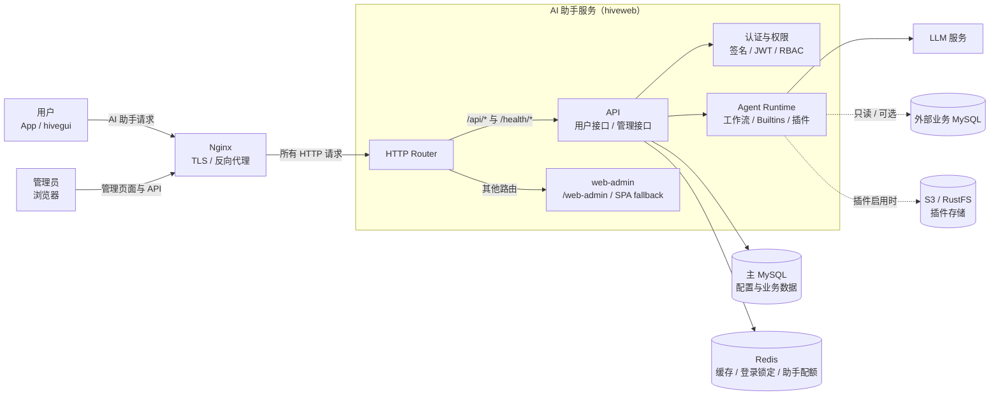

# 开发指南

## 系统架构

用户端和管理端统一通过 Nginx 访问系统。Nginx 负责 TLS 终止和反向代理；`hiveweb`
同时提供 AI 助手接口、管理接口，并直接托管 `web-admin` 构建产物。



- 用户请求经 Nginx 转发到 AI 助手 API，由 Agent Runtime 调用工作流、内置工具或插件。
- 管理员从 `/web-admin` 加载管理端，管理 API 由 `hiveweb` 提供并通过 JWT 和角色权限控制。
- 开发模式读取仓库的 `web-admin/dist`；测试和生产模式读取 `hiveweb` 二进制同级的 `dist`。
- 主 MySQL 和 Redis 是核心依赖；外部业务库与 S3/RustFS 根据功能配置启用。

## 后端开发

Redis 的连接模式、认证规则、实际 key 和故障行为见
[Redis 开发指南](dev-redis.md)。

```bash
# 运行测试
cargo test

# 代码格式化
cargo fmt

# 代码检查
cargo clippy -- -D warnings
```

## 前端开发

```bash
# 运行测试
npm test

# 代码格式化
npm run format

# 代码检查
npm run lint
```
